# PillarEditor User's Guide

**Version:** 1.0  
**Last Updated:** January 6, 2026  

A comprehensive guide to using the PillarEditor for 2D game development with the Pillar Engine.

---

## Table of Contents

1. [Introduction](#introduction)
2. [Getting Started](#getting-started)
3. [Interface Overview](#interface-overview)
4. [Scene Hierarchy Panel](#scene-hierarchy-panel)
5. [Inspector Panel](#inspector-panel)
6. [Viewport Panel](#viewport-panel)
7. [Content Browser Panel](#content-browser-panel)
8. [Console Panel](#console-panel)
9. [Animation System](#animation-system)
10. [Entity Templates](#entity-templates)
11. [Working with Scenes](#working-with-scenes)
12. [Play Mode](#play-mode)
13. [Transform Gizmos](#transform-gizmos)
14. [Undo/Redo System](#undoredo-system)
15. [Keyboard Shortcuts](#keyboard-shortcuts)
16. [Tips & Best Practices](#tips--best-practices)

---

## Introduction

PillarEditor is a professional 2D game editor built on top of the Pillar Engine. It provides a visual interface for creating and editing game scenes, managing entities, configuring components, and testing your game in real-time.

### Key Features

- **Visual Scene Editor** - Drag-and-drop entity creation and manipulation
- **Component-Based Architecture** - Add/remove components with live editing
- **Play Mode Testing** - Test your game instantly without leaving the editor
- **Transform Gizmos** - Visual translate, rotate, and scale tools
- **Undo/Redo** - Full command history for all edits
- **Entity Templates** - Reusable entity presets for rapid prototyping
- **Animation Editor** - Frame-by-frame sprite animation tools
- **Sprite Sheet Support** - Import and slice sprite sheets visually
- **Asset Browser** - Organized view of all project assets
- **Console Logging** - Real-time debug output with filtering

---

## Getting Started

### Launching the Editor

Run `PillarEditor.exe` from your build directory:
```
bin/Debug-x64/PillarEditor/PillarEditor.exe
```

### First Launch

When you first launch PillarEditor, you'll see:
- A default empty scene with a camera entity
- Multiple dockable panels arranged in the default layout
- The viewport displaying the scene view

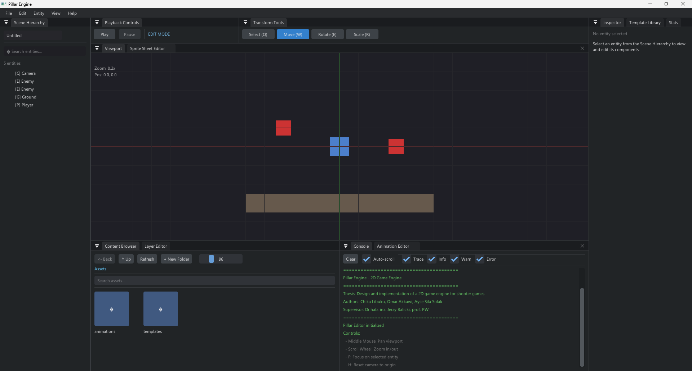

### Creating Your First Scene

1. **Create a New Scene**: File → New Scene (Ctrl+N) or start with the default scene
2. **Save the Scene**: File → Save Scene As (Ctrl+Shift+S) and choose a location in `assets/scenes/`
3. **Create an Entity**: Right-click in the Scene Hierarchy and select "Create Entity"
4. **Add Components**: Select the entity and use "Add Component" in the Inspector

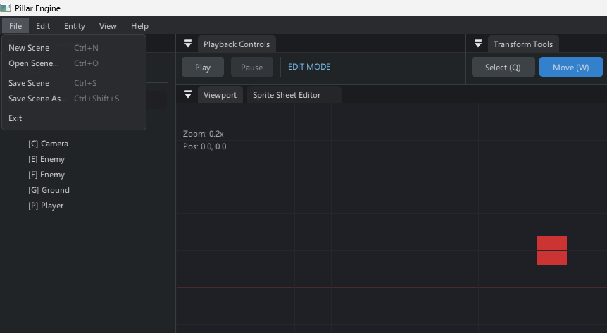

---

## Interface Overview

PillarEditor uses a dockable panel system powered by ImGui Docking. You can rearrange, resize, and tab panels to customize your workspace.

### Default Layout

The editor opens with the following panels:

| Panel | Location | Size | Purpose |
|-------|----------|---------|---------|
| **Viewport** | Center | ~54% | Scene rendering and entity manipulation (LARGEST) |
| **Scene Hierarchy** | Left | ~18% | Entity tree structure |
| **Inspector** | Right | ~28% | Component editing for selected entities |
| **Content Browser** | Bottom-Left | ~30% height | Asset browsing and management |
| **Console** | Bottom-Right | ~30% height | Log output with filtering |
| **Animation Manager** | Tab (Bottom-Right) | Optional | Animation clip management |
| **Template Library** | Tab (Right) | Optional | Entity template browser |

The viewport is intentionally the largest panel, centralized for optimal scene editing. All panels are properly docked on first launch.

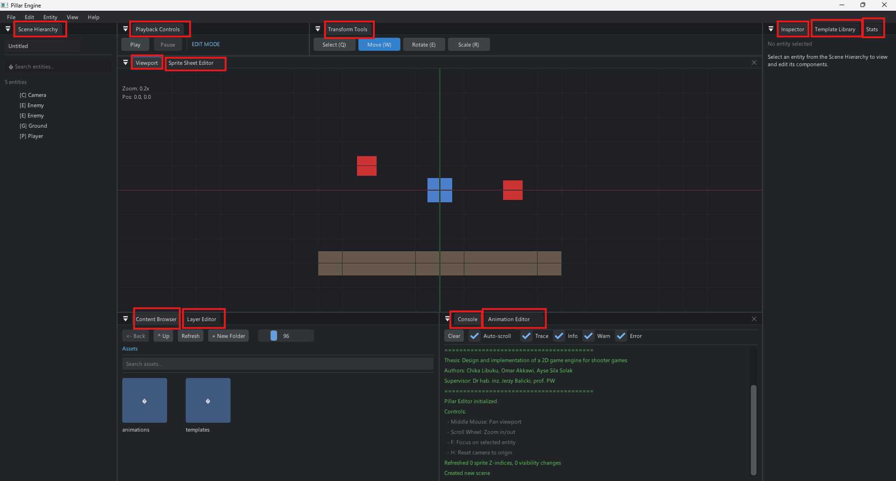

### Customizing the Layout

1. **Resize Panels** - Drag panel borders to resize
2. **Move Panels** - Drag panel title bar to undock and redock
3. **Create Tabs** - Drag panel onto another to create tabs
4. **Float Panels** - Drag panel outside dockspace to float

### Resetting the Layout

If you've rearranged panels and want to restore the default:

1. Go to **View → Reset Layout**
2. The layout will reset on the next frame
3. All panels return to their default positions and sizes

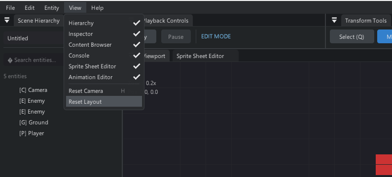

### Menu Bar

#### File Menu
- **New Scene** (Ctrl+N) - Create a blank scene
- **Open Scene** (Ctrl+O) - Load an existing scene
- **Save Scene** (Ctrl+S) - Save current scene
- **Save Scene As** (Ctrl+Shift+S) - Save scene with new name
- **Recent Files** - Quick access to recently opened scenes
- **Exit** - Close the editor

#### Edit Menu
- **Undo** (Ctrl+Z) - Undo last action
- **Redo** (Ctrl+Y) - Redo previously undone action
- **Duplicate** (Ctrl+D) - Duplicate selected entities

#### View Menu
- Toggle visibility of each panel
- Reset Layout - Restore default panel arrangement

#### Entity Menu
- **Create Entity** - Create a new empty entity
- **Create Template** - Create entity from template library

---

## Scene Hierarchy Panel

The Scene Hierarchy displays all entities in your scene as a tree structure. It supports parent-child relationships and multi-selection.


### Creating Entities

**Right-click in empty space:**
- **Create Entity** - Create a new entity with default components (Tag, Transform, UUID, Hierarchy)
- **Create Template** - Browse and instantiate entity templates

**Keyboard:**
- **Ctrl+Shift+N** - Create new entity

### Selecting Entities

- **Left-Click** - Select a single entity
- **Ctrl+Click** - Add/remove entity from selection
- **Click Empty Space** - Deselect all

Selected entities are highlighted in orange.

### Entity Operations

**Right-click on an entity:**
- **Duplicate** (Ctrl+D) - Create a copy
- **Delete** (Delete key) - Remove entity

---

## Inspector Panel

The Inspector displays and allows editing of all components attached to the selected entity. Each component type has a specialized editor interface.

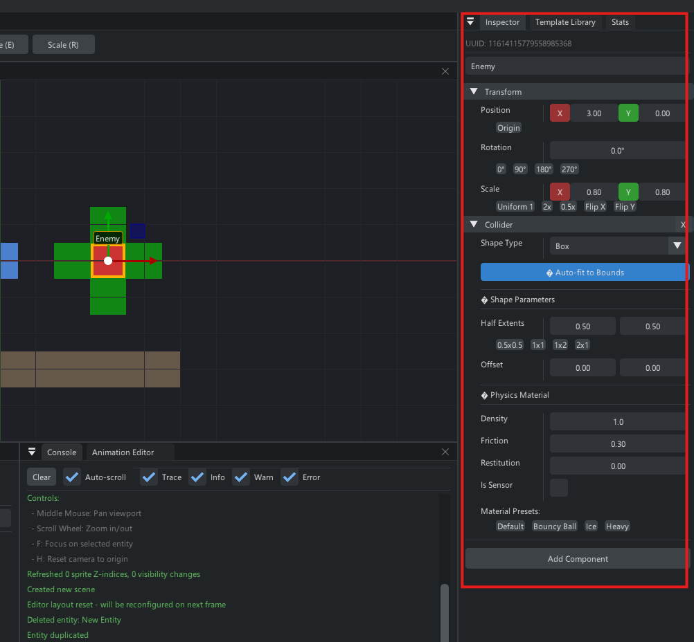

### Component Headers

Each component has a collapsible header showing:
- Component type name
- Collapse/expand arrow
- **Remove button (X)** - Delete the component (not available for Transform/Tag)

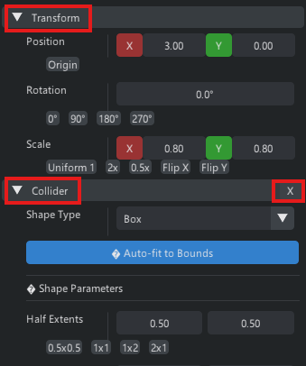

### Transform Component

**Non-removable.** Defines the entity's position, rotation, and scale.

- **Position** (X, Y) - World space coordinates
- **Rotation** (degrees) - Rotation angle in degrees
- **Scale** (X, Y) - Size multiplier

**Features:**
- Drag values to adjust incrementally
- Click and type for precise values
- Right-click for reset options
- Linked to viewport gizmos


### Sprite Component

Renders a textured or colored quad.

- **Texture** - Drag & drop from Content Browser
- **Color** - RGBA color picker with tint control
- **Size** (Width, Height) - Sprite dimensions in world units
- **Use Texture Size** - Button to match sprite size to texture dimensions
- **Sorting Layer** - Render order layer name
- **Order in Layer** - Render priority within layer

**Presets:**
- **White Square** - Default white sprite
- **Colored Sprite** - Common solid colors (Red, Green, Blue, Yellow)

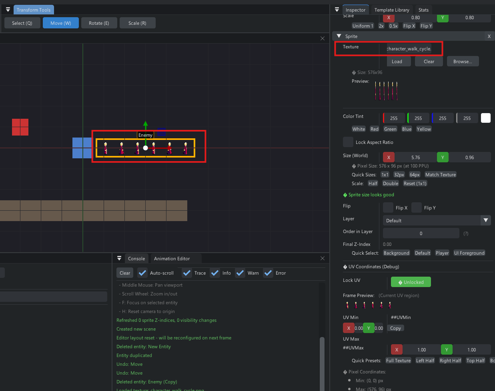

### Velocity Component

Adds constant velocity to entity position each frame.

- **Velocity** (X, Y) - Movement speed in units per second
- **Enable Rotation** - Align sprite with velocity direction

**Presets:**
- **Stationary** (0, 0)
- **Move Right** (5, 0)
- **Move Up** (0, 5)
- **Diagonal** (3.5, 3.5)

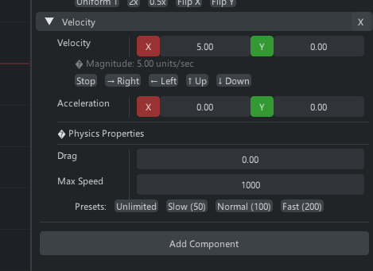

### Rigidbody Component

Makes entity participate in physics simulation (Box2D integration).

- **Body Type**
  - **Static** - Immovable, infinite mass (walls, floors)
  - **Dynamic** - Full physics simulation (player, enemies)
  - **Kinematic** - Velocity-controlled, no physics forces (platforms)
- **Fixed Rotation** - Prevent physics rotation
- **Gravity Scale** - Multiply global gravity (0 = no gravity, 1 = normal)
- **Linear Damping** - Slow down over time (air resistance)
- **Angular Damping** - Slow rotation over time

**Presets:**
- **Static Wall**
- **Dynamic Object** (player/enemy)
- **Kinematic Platform**
- **Zero Gravity**

**Warning:** Requires a Collider component to work!

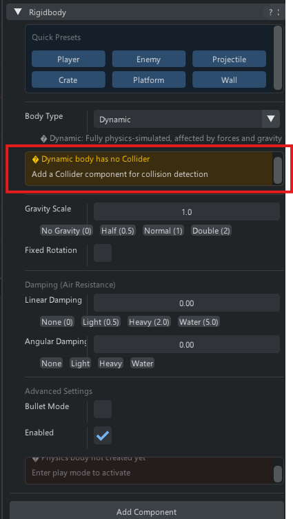

### Collider Component

Physics collision shape.

- **Type** - Circle, Box or polygon
- **Size** (Width, Height) - Collider dimensions
- **Offset** (X, Y) - Position offset from transform
- **Is Sensor** - Detect collisions without physical response (triggers)
- **Density** - Mass per unit area
- **Friction** - Surface friction (0 = ice, 1 = rubber)
- **Restitution** - Bounciness (0 = no bounce, 1 = perfect bounce)

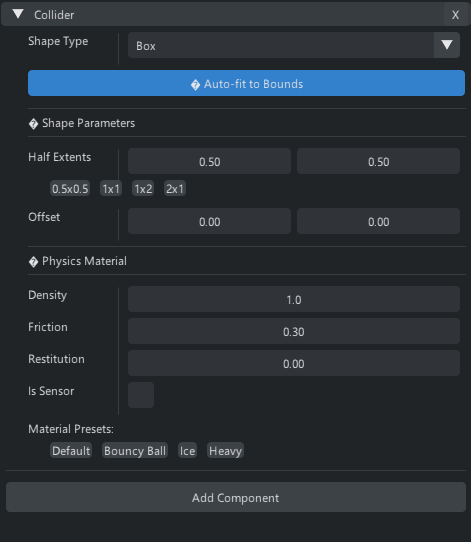


### Camera Component

Makes entity act as a rendering camera.

- **Orthographic Size** - Half-height of visible area in world units
- **Primary** - Mark as the active rendering camera
- **Fixed Aspect Ratio** - Maintain aspect ratio on window resize

**Note:** Scenes must have exactly one primary camera.

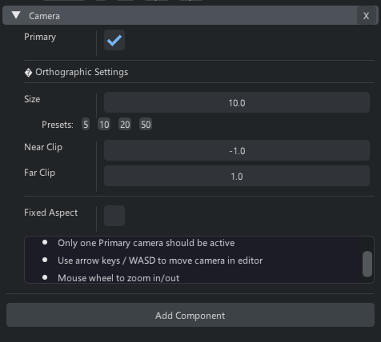

### Animation Component

Plays sprite animations using animation clips.

- **Animation Clip** - Select animation asset from dropdown
- **Current Animation** - Display name of active animation
- **Playing** - Playback state indicator
- **Playback Speed** - Speed multiplier (1.0 = normal speed)

**Controls:**
- **Play** - Start animation playback
- **Pause** - Pause animation
- **Stop** - Stop and reset to first frame


### Adding Components

Click **"Add Component"** button at bottom of Inspector to open component menu.

**Available Components:**
- Velocity
- Rigidbody
- Box Collider
- Circle Collider
- Sprite
- Camera
- Animation
- Bullet
- XP Gem

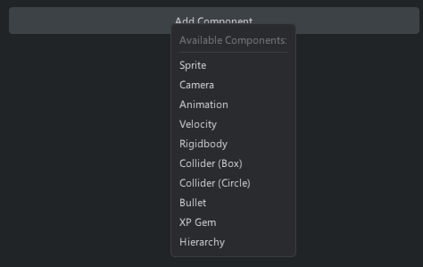

### Removing Components

Click the **X button** in the component header. Transform components cannot be removed.

---

## Viewport Panel

The Viewport displays your scene with real-time rendering. It supports camera navigation, entity selection, and transform manipulation.

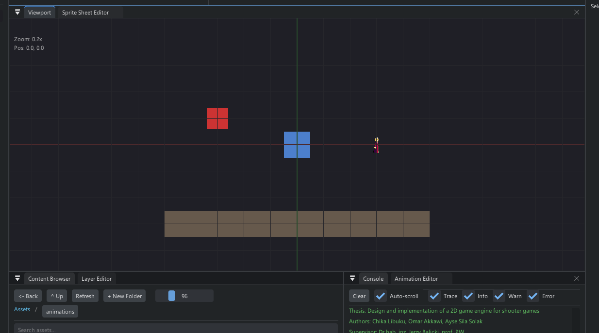

### Viewport Controls

#### Camera Navigation

- **Middle Mouse Button (Hold)** - Pan camera
- **Mouse Wheel** - Zoom in/out
- **F Key** - Focus on selected entity
- **Alt+Mouse Wheel** - Fine zoom control

#### Entity Selection

- **Left-Click** on entity - Select entity
- **Ctrl+Left-Click** - Multi-select toggle
- **Click Empty Space** - Deselect all

Selected entities are highlighted with a **bright orange outline** (4-line box).

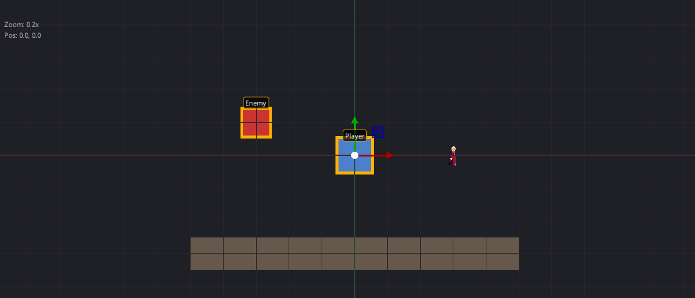

### Viewport Toolbar

Located at the top of the viewport:

- **Play Button** ▶ (Ctrl+P) - Enter play mode
- **Pause Button** ⏸ - Pause simulation
- **Stop Button** ⏹ (Ctrl+Shift+P) - Exit play mode
- **Gizmo Mode Buttons** - Switch between transform tools (W/E/R)

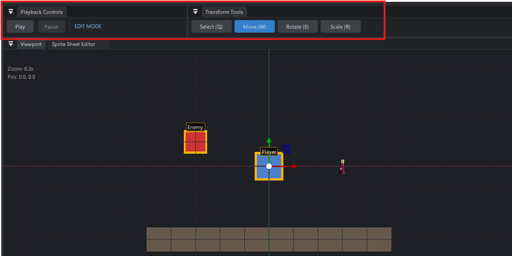

### Selection Highlighting

Selected entities are rendered with a bright orange box outline:
- 4 lines: top, bottom, left, right
- Color: (1.0, 0.7, 0.0, 1.0) - Orange
- Renders on top of all entities
- Visible even when entity is behind others

---

## Content Browser Panel

The Content Browser provides a file explorer for your project assets. It displays textures, audio files, scenes, and other resources.


### Navigation

- **Double-Click Folder** - Navigate into folder
- **Back Button** - Return to parent directory
- **Root Directory** - Project `assets/` folder

### Asset Types

#### Textures (PNG, JPG, TGA)
- **Thumbnail Preview** - Visual preview of image
- **Drag to Inspector** - Add to Sprite component texture slot
- **Double-Click** - Open in external image editor (if configured)

#### Audio Files (WAV)
- **Waveform Icon** - Audio file indicator
- **Drag to Inspector** - Add to Audio Source component

#### Scene Files (.scene.json)
- **Double-Click** - Open scene in editor

#### Animation Files (.anim.json)
- **Drag to Entity in hierarchy** - Add to Animation component

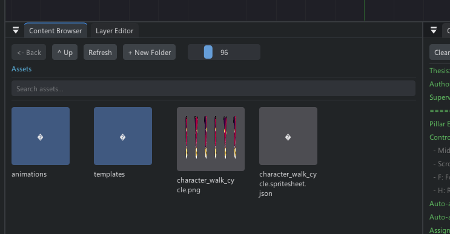


### Asset Operations

**Right-Click on Asset:**
- **Rename** - Change asset filename
- **Delete** - Move to system trash
- **Show in Explorer** - Open file location in Windows Explorer
- **Copy Path** - Copy relative asset path to clipboard

**Right-Click in Empty Space:**
- **Create Folder** - Create new subdirectory
- **Import** - Open system file dialog to import assets
- **Refresh** - Reload directory contents

---

## Console Panel

The Console displays runtime log messages with filtering and search capabilities.

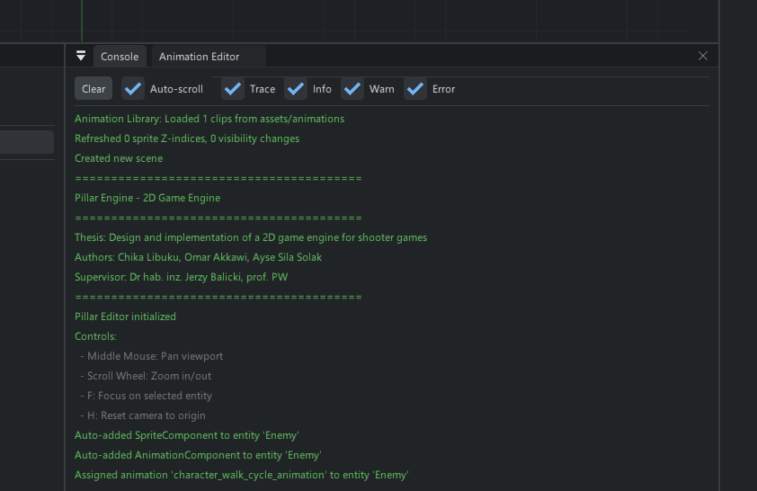

### Log Levels

- **Trace** - Detailed debug information (gray)
- **Info** - General information (white)
- **Warning** - Non-critical issues (yellow)
- **Error** - Critical errors (red)

### Console Controls

- **Clear** - Remove all log entries
- **Filter Buttons** - Toggle visibility by log level
  - Trace
  - Info
  - Warning
  - Error
- **Auto-Scroll** - Automatically scroll to newest messages

### Using the Console

The console automatically displays:
- Scene loading/saving messages
- Asset loading messages
- Physics warnings
- Script errors
- Custom log messages from your game code

**Example Custom Logging:**
```cpp
ConsolePanel::Log("Controls:", LogLevel::Info);
ConsolePanel::Log("  - Middle Mouse: Pan viewport", LogLevel::Trace);
```

---

### Sprite Sheet Editor Panel

For importing sprite sheet atlases.


#### Importing Sprite Sheets

1. **Load Texture** - Select sprite sheet image, drag and drop also support from content browser panel
2. **Configure Grid:**
   - **Cell Width/Height** - Size of each sprite in pixels
   - **Spacing** - Pixels between sprites
   - **Padding** - Starting position in texture
3. **Preview Grid** - Overlay shows slice boundaries
4. **Add to Frame Library** - Create individual frame from selected cell in preview grid
5. **Export to Animation** - Create animation clip from sequence (Can then be viewed in the content browser and in the Animation Editor)

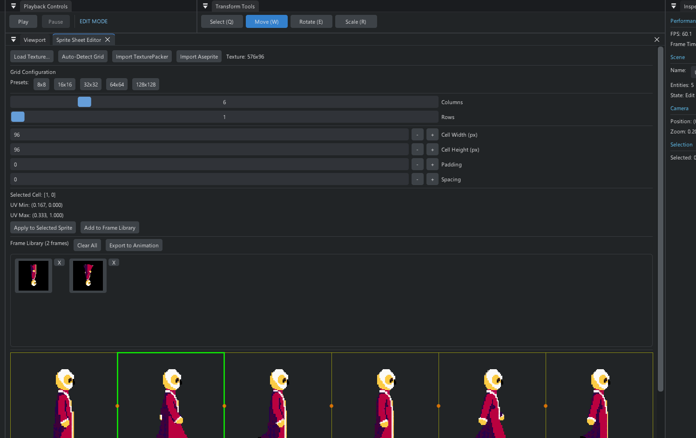

## Animation System

PillarEditor includes comprehensive sprite animation tools for frame-by-frame animation.

### Animation Manager Panel


#### Creating Animation Clips

1. Once frame library is complete in the **Sprite Sheet Editor**, Click **"Export to Animation"**, the clip will be then available in the animation editor as well as in your assets/animations, the json will be visiblel.
3. In the Animation editor, you can:
   - Duplicate frames
   - Set frame duration (seconds per frame)
   - Reorder frames by dragging
4. **Set Properties:**
   - **Looping** - Repeat animation
   - **Speed** - Playback speed multiplier
5. **Save Clip** - Saves as `.anim.json` file

#### Animation Clip Properties

- **Clip Name** - Display name
- **Total Duration** - Sum of all frame durations
- **Frame Count** - Number of frames
- **Default Loop** - Enable looping

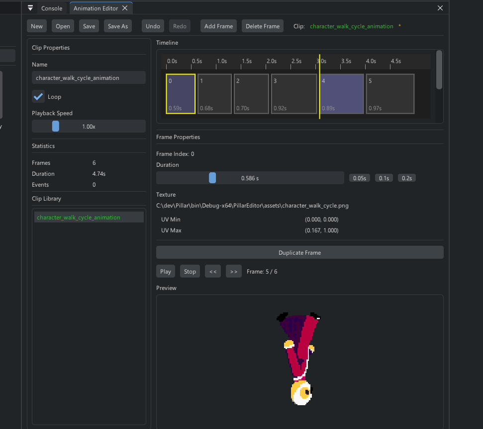


### Using Animations in Game

1. Add **Animation Component** to entity
2. Add **Sprite Component** to entity (required)
3. Select animation clip in component dropdown
4. Animation plays automatically in play mode

**Code Example:**
```cpp
// Playing animations via script
auto& anim = entity.GetComponent<AnimationComponent>();
anim.Play("walk_right");
anim.SetSpeed(1.5f);

// Animation events
anim.OnAnimationComplete = [](entt::entity e) {
    // Animation finished
};
```

---

## Entity Templates

Templates are reusable entity presets that speed up development. Create once, instantiate many times.

### Template Library Panel

### Creating Templates

**Method 1: From Scene Hierarchy**
1. Set up an entity with desired components
2. Right-click entity in hierarchy
3. Select **"Save as Template"**
4. Name the template

**Method 2: JSON Files**
Create `.template.json` files in `assets/templates/`:
```json
{
    "name": "Player",
    "description": "Playable character template",
    "components": {
        "Transform": { "Position": [0, 0], "Scale": [1, 1] },
        "Sprite": { "Color": [0.2, 0.8, 0.3, 1.0] },
        "Velocity": { "Velocity": [0, 0] },
        "Rigidbody": { "BodyType": "Dynamic" },
        "CircleCollider": { "Radius": 0.5 }
    }
}
```

### Using Templates

**Method 1: Template Library Panel**
1. Browse templates in Template Library
2. Click **"Instantiate"** button

**Method 2: Scene Hierarchy**
1. Right-click in Scene Hierarchy
2. Select **"Create from Template"**
3. Choose template from list

### Built-in Templates

PillarEditor includes common templates:
- **Player** - Character with physics and collision
- **Enemy** - Basic enemy setup
- **Wall** - Static physics obstacle
- **Collectible** - Item with trigger collider
- **Bullet** - Projectile with lifetime
- **Camera** - Standard game camera

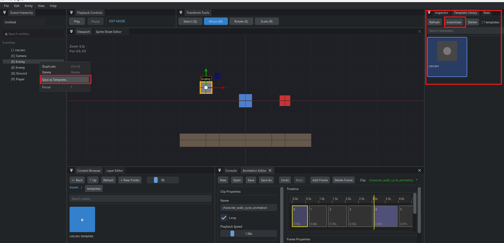


---

## Working with Scenes

### Scene File Format

Scenes are saved as JSON files (`.scene.json`) containing:
- Entity hierarchy
- Component data
- Scene settings
- Asset references

**Recommended Location:** `assets/scenes/Level1.scene.json`

### Creating New Scenes

1. File → New Scene (Ctrl+N)
2. Confirms save of current scene if modified
3. Creates empty scene with default camera

### Opening Scenes

**Method 1: File Menu**
- File → Open Scene (Ctrl+O)
- Navigate to `.scene.json` file

**Method 2: Content Browser**
- Double-click scene file

### Saving Scenes

- **Save** (Ctrl+S) - Quick save to current file
- **Save As** (Ctrl+Shift+S) - Save with new filename

**Best Practice:** Save frequently! The editor has auto-save, but manual saves ensure data safety.


---

## Play Mode

Play Mode allows you to test your game directly in the editor without building.

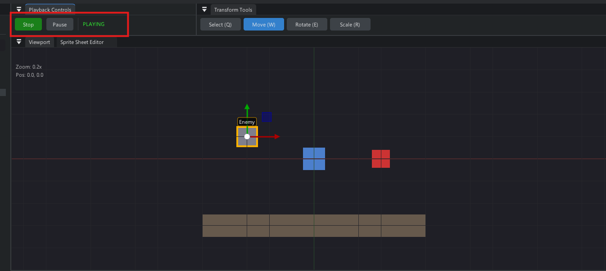

### Entering Play Mode

**Methods:**
- Click **Play Button** ▶ in viewport toolbar
- Press **Ctrl+P**

**What Happens:**
1. Current scene state is backed up
2. All game systems activate (physics, audio, animation)
3. Viewport switches to game camera
4. Editor UI remains active for debugging

### Play Mode Features

- **Full Physics Simulation** - Box2D runs normally
- **Input Handling** - WASD, mouse, etc. work as in game
- **Audio Playback** - Sounds play with 3D positioning
- **Animation Playback** - Sprite animations play
- **Live Inspector** - Watch component values update in real-time

**Warning:** Edits made in play mode are NOT saved!

### Pausing Simulation

Click **Pause Button** ⏸ or press **Ctrl+Shift+Pause** to pause simulation:
- Physics stops updating
- Audio pauses
- Animations freeze
- Inspect entity states without changes

Click pause again to resume.

### Exiting Play Mode

**Methods:**
- Click **Stop Button** ⏹ in toolbar
- Press **Ctrl+Shift+P**

**What Happens:**
1. Simulation stops
2. Scene state is restored to pre-play snapshot
3. All temporary runtime changes are discarded
4. Editor camera is restored

---

## Transform Gizmos

Gizmos are visual tools for manipulating entity transforms directly in the viewport.

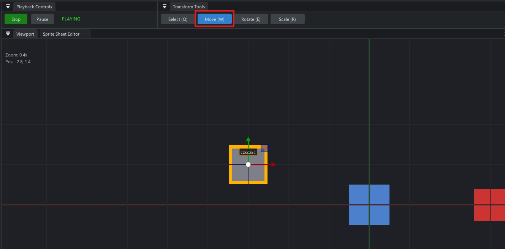
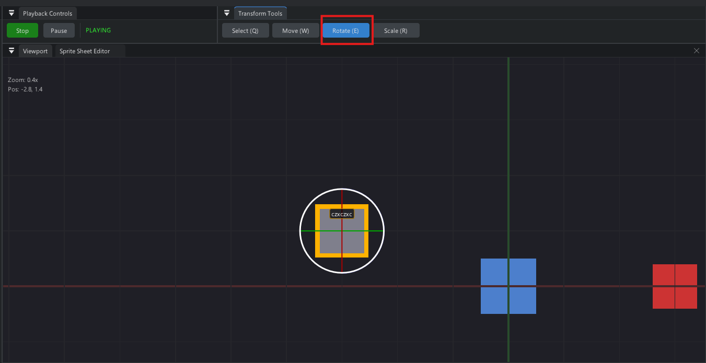
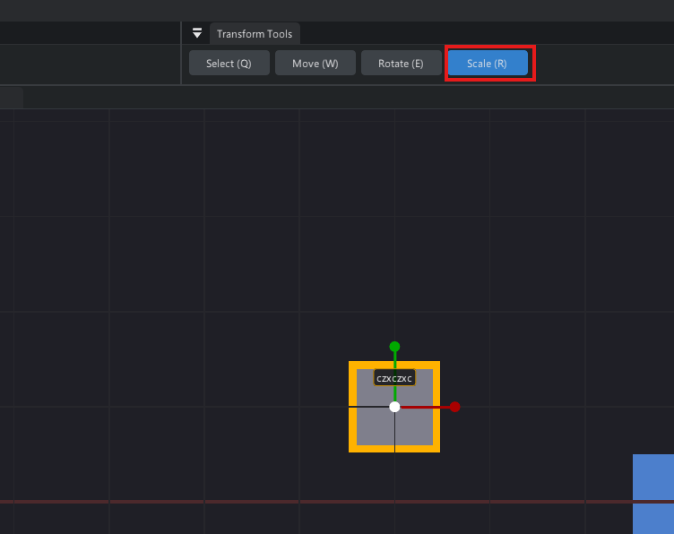

### Gizmo Modes

| Mode | Hotkey | Icon | Purpose |
|------|--------|------|---------|
| **Translate/Move** | W | ⊕ | Move entity position |
| **Rotate** | E | ⟲ | Rotate entity |
| **Scale** | R | ⊡ | Change entity size |

### Using Translate Gizmo

- **Red Arrow (X-axis)** - Drag to move horizontally
- **Green Arrow (Y-axis)** - Drag to move vertically
- **Blue Square/ White dot(Center)** - Drag to move in any direction

**Snapping:**
- Hold **Ctrl** while dragging to snap to grid (configurable increment)

### Using Rotate Gizmo


- **White Circle** - Drag around circle to rotate
- Shows angle indicator as you drag

**Snapping:**
- Hold **Ctrl** to snap to 15-degree increments

### Using Scale Gizmo

- **Red Handle (X-axis)** - Scale width
- **Green Handle (Y-axis)** - Scale height
- **Yellow Square (Center)** - Uniform scale (proportional)

**Snapping:**
- Hold **Ctrl** to snap to 0.1 increments

### Gizmo Settings

Gizmos are fully integrated with:
- **Undo/Redo** - All gizmo operations can be undone (Ctrl+Z)
- **Multi-Select** - Transform multiple entities at once (moves all selected entities)
- **Coordinate Space** - Local vs. World space toggle (future feature)

---

## Undo/Redo System

PillarEditor includes a comprehensive undo/redo system for all editing operations.

### Supported Operations

- **Transform Changes** - Position, rotation, scale
- **Component Edits** - Any component property change
- **Entity Creation/Deletion**
- **Component Add/Remove**
- **Hierarchy Changes** - Parenting operations

### Using Undo/Redo

**Undo:**
- Edit → Undo
- **Ctrl+Z**

**Redo:**
- Edit → Redo
- **Ctrl+Y** or **Ctrl+Shift+Z**

### Command History

The editor maintains a history of the last **100 commands**. Older commands are automatically removed to save memory.

---

## Keyboard Shortcuts

### General

| Shortcut | Action |
|----------|--------|
| **Ctrl+N** | New Scene |
| **Ctrl+O** | Open Scene |
| **Ctrl+S** | Save Scene |
| **Ctrl+Shift+S** | Save Scene As |
| **Ctrl+Z** | Undo |
| **Ctrl+Y** | Redo |
| **Ctrl+D** | Duplicate Entity |
| **Delete** | Delete Entity |

### Viewport

| Shortcut | Action |
|----------|--------|
| **MMB (Hold)** | Pan Camera |
| **Mouse Wheel** | Zoom In/Out |
| **F** | Focus on Selected Entity |
| **W** | Translate Gizmo Mode |
| **E** | Rotate Gizmo Mode |
| **R** | Scale Gizmo Mode |

### Entity Hierarchy

| Shortcut | Action |
|----------|--------|
| **Ctrl+Click** | Multi-Select Toggle |

### Gizmo Modifiers

| Shortcut | Action |
|----------|--------|
| **Ctrl+Drag** | Snap to Grid/Increment |

---

## Tips & Best Practices

### Organization

1. **Use Meaningful Names** - Name entities descriptively ("Player", "Enemy_Goblin", "Wall_Left")
2. **Layer Your Sprites** - Use Sorting Layers to control render order
3. **Folder Structure** - Organize assets into `textures/`, `audio/sfx/`, `audio/music/`, `scenes/`


### Debugging

1. **Watch the Console** - Check for warnings/errors regularly
2. **Use Inspector in Play Mode** - Watch values update live
3. **Selection Highlighting** - Orange outlines help identify selected entities
4. **Pause to Inspect** - Use pause button to freeze simulation and examine state

### Component Setup

1. **Transform First** - Set position/scale before adding other components
2. **Physics Pairs** - Always pair Rigidbody with a Collider
3. **Sprite + Animation** - Animation requires Sprite component
4. **Test Colliders** - Use play mode to verify collision shapes

### Asset Management

1. **Relative Paths** - Keep all assets in `assets/` folder
2. **PNG for Transparency** - Use PNG for sprites with alpha channel
3. **WAV for Audio** - Only WAV format is currently supported
4. **Scene Backups** - Keep backup copies of important scenes
5. **Version Control** - Use Git to track scene and asset changes

---

## Appendix

### File Formats

#### Scene File (.scene.json)
JSON format containing:
- Entity list with UUIDs
- Component data for each entity
- Hierarchy relationships
- Asset references (paths)

#### Animation Clip (.anim.json)
JSON format containing:
- Frame list with texture paths
- Frame durations
- Looping flag
- Total duration

#### Entity Template (.template.json)
JSON format containing:
- Template name and description
- Component type list
- Default component values

### Asset Paths

PillarEditor uses relative paths from project root:
- Textures: `assets/textures/`
- Audio: `assets/audio/`
- Scenes: `assets/scenes/`
- Animations: `assets/animations/`
- Templates: `assets/templates/`

During development, the editor searches:
1. `PillarEditor/assets/` (for editor testing)
2. `assets/` next to executable (for distribution)

---

## Getting Help

### Resources

- **Engine Guide**: See `USERS_GUIDE.md` for Pillar Engine API reference
- **Installation**: See `INSTALLATION_GUIDE.md` for build instructions

### Feature Requests

We welcome suggestions! Consider:
- What problem does it solve?
- How would the UI/UX work?
- Is there a workaround currently?

---

**End of PillarEditor User's Guide**

*Happy game making!*
